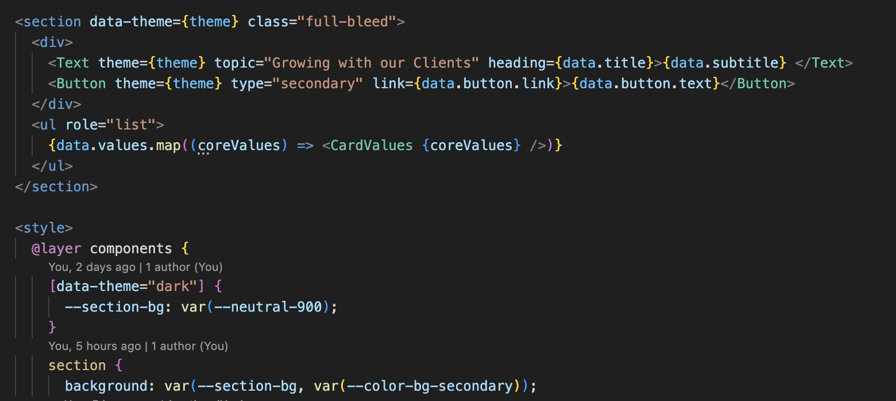

# Refleksioner

## Proces

Første store projekt, jeg har skulle kode selv, så skal være skarpere på min tidsestimering. Har ikke arbejdet helt så meget med fx container-querys, som ønsket. View transitions og små UI animationer generelt, har jeg ikke fået prioriteret højt nok i dette projekt, så det må jeg have til gode til næste gang.

## Teknisk

### Themes

Det har været sjovt at arbejde med themes, og er klart en teknik jeg kommer til at bruge fremover. Jeg skulle lige lure, hvordan jeg skulle gøre, når der var andre komponenter inde i det overordnet, som også skulle have en tema-ændring, men fik løst dette. Er dog nysgerrig på om det kan gøres endnu smartere, men det bliver sjovt at arbejde videre med.

Derudover har jeg lavet semantiske variabler i min global.css (som blot henviser til de primitive), men kan ikke finde ud med mig selv om de semantiske variabler har givet mening eller blot forvirret mig mere. Fx når de bruges til themes skal man holde tungen lige i munden.

Eller måske det blot kan løses med et bedre system for, hvordan jeg navngiver de semantiske variabler.

### Pop over

Pop-over'en nået lige at drille mig lidt, eftersom den ligger som barn af body. På body er mit overordnede grid, så den display-none, som ellers er default på pop-over, var allerede blevet overskrevet, så den kunne ses i mit layout, før den var blevet klikket på. Det er noget jeg lige vil skrive mig bag øret til næste gang.

### Image-component

Jeg har levet et nyt component til hver af de billeder som har pseudo elementer bag sig. Kan man gøre det smartere? Meget kode der bliver gentaget, for bare at ændre selve billedet og hvor pseudo-elementerne er placeret

### Responsivitet

Hvornår skal man bruge container/media querys? Hvornår giver flex wrap mening? Det er noget af det jeg stadig lige skal finde ud af, da det ikke kommer helt naturligt endnu.

Og så har jeg stadig lidt svært ved at designe i kode - har lettere ved at have et udgangspunkt som jeg bare kopiere - så det er også noget jeg skal øve mig i.
